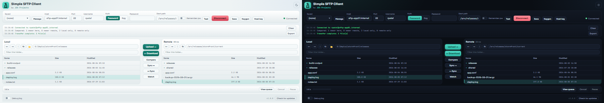

# Simple SFTP Client

A clean, dual-pane SFTP client: browse local and remote side by side, transfer
with a background queue, save sessions, compare and sync folders, and watch a
local folder for auto-upload. Secure connections only.

Built by [JDE-Projects](https://jde-projects.com), home of the Simple X Tools suite.

If you enjoyed this project and would like to buy me a coffee, check out my [Ko-fi](https://ko-fi.com/jdeprojects).

## Preview

<p align="center">
  
  <br><em>Dark and light themes</em>
</p>

## Highlights
- Dual-pane browser with breadcrumb paths, back/forward, recent locations, and
  an instant per-pane filter.
- Quick connect plus saved sessions (host, port, user, key path, start path;
  never a password).
- Key authentication, with a built-in generator for Ed25519 (default) or
  RSA-4096 key pairs.
- Background transfer queue with progress and ETA: pause and resume it, retry a
  failed item in one click, and it speeds up automatically for big batches of
  small files.
- Compare local vs remote and sync folders in either direction, across
  subfolders too, with a preview of what will transfer and a
  download-changed-only option. Folders with more than 500,000 items on
  either side are refused (at that size Compare and Sync can use about 1 GB of
  memory).
- Safe transfers: files are written to a temporary copy and swapped in only
  when complete, so an interrupted transfer never damages the existing file.
  Servers that can't swap files safely have uploads refused.
- Before overwriting, a per-file comparison shows each file's size, date, and
  which side is newer, so you can overwrite, skip existing, or cancel.
- Transfers keep each file's original modification date where the server and
  Windows allow it, so a repeat download-changed-only run fetches just what
  actually changed.
- Upload watcher: keep a remote folder up to date from a local one.
- Remote directory size calculation (on demand) and a connection health
  indicator.
- Built-in check for updates against GitHub Releases.
- Optional debug log, off by default. The app never logs passwords or
  passphrases, and the log scrubs credentials embedded in URLs and any
  private-key material as a backstop.
- Secure transport only: weak or vulnerable algorithms are disabled, so the
  app connects securely or fails with a clear message (no unsafe fallback).

## How it works
- Backend: paramiko over SSH/SFTP.
- Saved sessions: `servers.json` next to the app (no passwords).
- Window: pywebview on the Qt backend, UI in `simple_sftp_client-UI.html`.

## Download and run
Three ways to get it - pick one. The installer and .zip are on the
[Releases](../../releases) page.
- **WinGet:** `winget install --exact --id JDE-Projects.SimpleSFTPClient`
- **Installer (recommended):** download `SimpleSFTPClient-vX.Y.Z-setup.exe` and
  run it. Installs the app, adds a Start menu shortcut, and can be removed later
  from Add or Remove Programs. Installs just for you by default (no admin); you can
  choose all users during setup.
- **Portable .zip:** download `SimpleSFTPClient-vX.Y.Z.zip`, extract it, and run
  `Simple SFTP Client.exe` from inside the extracted folder. No install - good for
  a locked-down PC or a USB stick. Keep the folder together.
Windows only, no Python or setup required. Unsigned, so SmartScreen may warn the
first time: More info > Run anyway.

## Updating

Simple SFTP Client doesn't update itself. The bottom bar has a **Check for
updates** button that tells you when a newer release is out; when it does,
get the new version from the [Releases](../../releases) page the same way you
first installed it.

- **WinGet:** run `winget upgrade --exact --id JDE-Projects.SimpleSFTPClient`.
- **Installer:** download the new `SimpleSFTPClient-vX.Y.Z-setup.exe` and run
  it. It installs over your current copy and keeps your saved sessions and
  theme choice.
- **Portable .zip:** download and extract the new `SimpleSFTPClient-vX.Y.Z.zip`.
  To keep your saved sessions, copy `servers.json`, `known_hosts`, and
  `simple_sftp_client.pref` from the old folder into the new one.

Passwords remembered via "Remember password" live in the Windows Credential
Manager, not the app folder, so they survive an update on the same machine;
there's nothing else to carry over.

## Verify this download (optional)
This release was built on GitHub from this public source, not on a personal
machine, and is signed with a build-provenance attestation. To confirm your
download is genuine, install the [GitHub CLI](https://cli.github.com) and run:

```
gh attestation verify SimpleSFTPClient-vX.Y.Z.zip \
  --repo JDE-Projects/Simple-SFTP-Client \
  --signer-repo JDE-Projects/Build-Tools
```

A `Verification succeeded!` line means the file was built by the published
pipeline from this repo. You can also check the file against the published
`.sha256`.

## Build from source (optional)
- Python 3 on PATH.
- `pip install -r requirements.txt` (pinned versions: PySide6, pywebview,
  paramiko, cryptography, keyring, and PyInstaller)
- Keep `simple_sftp_client.py`, `transfer_queue.py`, `debug_log.py`,
  `simple_sftp_client-UI.html`, the `fonts/` folder, the `.ico`, and `.png`
  together.
- Run from source: `python simple_sftp_client.py`
- Build the .exe: `Build_Simple_SFTP_Client.bat` -> `dist\Simple SFTP Client\Simple SFTP Client.exe`

## Using it
1. Enter host, port, and username, then a password or a private key. Connect.
   Verify the server fingerprint on first connection.
2. Save the connection for one-click reconnect (optionally a start path).
3. Browse the panes; transfer with the center arrows or drag-and-drop.
4. Use Compare / Sync to reconcile folders, or the watcher to auto-upload
   local changes.
5. Generate an Ed25519 or RSA key pair from the connection panel if you want
   to switch a host to key auth.

## Security and privacy
- Passwords and key passphrases are held in memory only and are never written
  to a file, except an opted-in remembered password (see below). On
  disconnect, the app clears its own copies from the connection fields. This
  does not guarantee the operating system has erased the value from physical
  memory.
- `servers.json` holds your saved sessions, never passwords. Treat it as
  sensitive: it maps your internal hosts and accounts, so don't share it
  publicly (in a bug report, forum post, or public repo).
- "Remember password" is opt-in per session and stores the password in the
  Windows Credential Manager (via `keyring`), not in any file.
- Only modern, secure key-exchange, ciphers, and MACs are offered; known-weak
  algorithms are disabled. There is no "compatibility" downgrade.
- Deleting a remote file or folder is permanent and cannot be undone; the app
  confirms first.
- The optional debug log is off by default; when on it writes
  `Debug_Log_MMDDYYYY_HHMMSS.txt` next to the app (a same-second clash adds
  `_2`, `_3`, and so on). Each file stops at 5 MiB and rolls over to a new
  one; the app keeps the active file plus at most 3 older ones (20 MiB
  total) and deletes only its own log files, next to the app, once there are
  more. The app never logs passwords or passphrases; as a backstop, the log
  also scrubs any credentials embedded in URLs and any private-key material
  before writing. If a log file can't be written, the debug log turns itself
  off and shows a warning in the console rather than failing silently.
- **Network use.** Other than the job you ask of it, this app makes one automatic network call: a check to GitHub for a newer release (at startup and when you press **Check for updates**), which sends only a version request. It collects and sends no personal data, usage data, or analytics.
- **Privacy policy.** The full privacy policy for this app and the other JDE-Projects tools is at https://jde-projects.com/privacy.

## A note on how this was built
This project was built with AI assistance. The design decisions, feature
direction, and real-world testing were directed by me. The code was written
and revised with an AI assistant against that direction. Treat it like any
community tool: review and test it before relying on it.

## License
Released under the PolyForm Noncommercial License 1.0.0 (see
[LICENSE](LICENSE)). Personal and any noncommercial use, modification, and
noncommercial redistribution are permitted; commercial use is not. Keep the
copyright notice; no warranty. This tool bundles third-party code; see
[THIRD-PARTY-LICENSES.txt](THIRD-PARTY-LICENSES.txt).

For commercial licensing, open a [GitHub issue](https://github.com/JDE-Projects/Simple-SFTP-Client/issues) with the title "Commercial License Inquiry".
